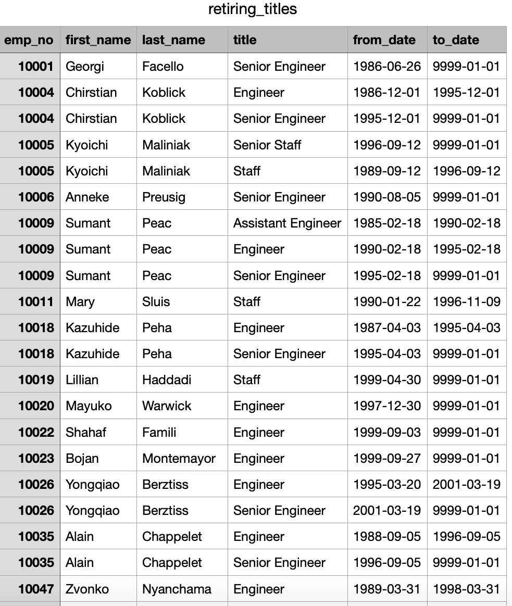
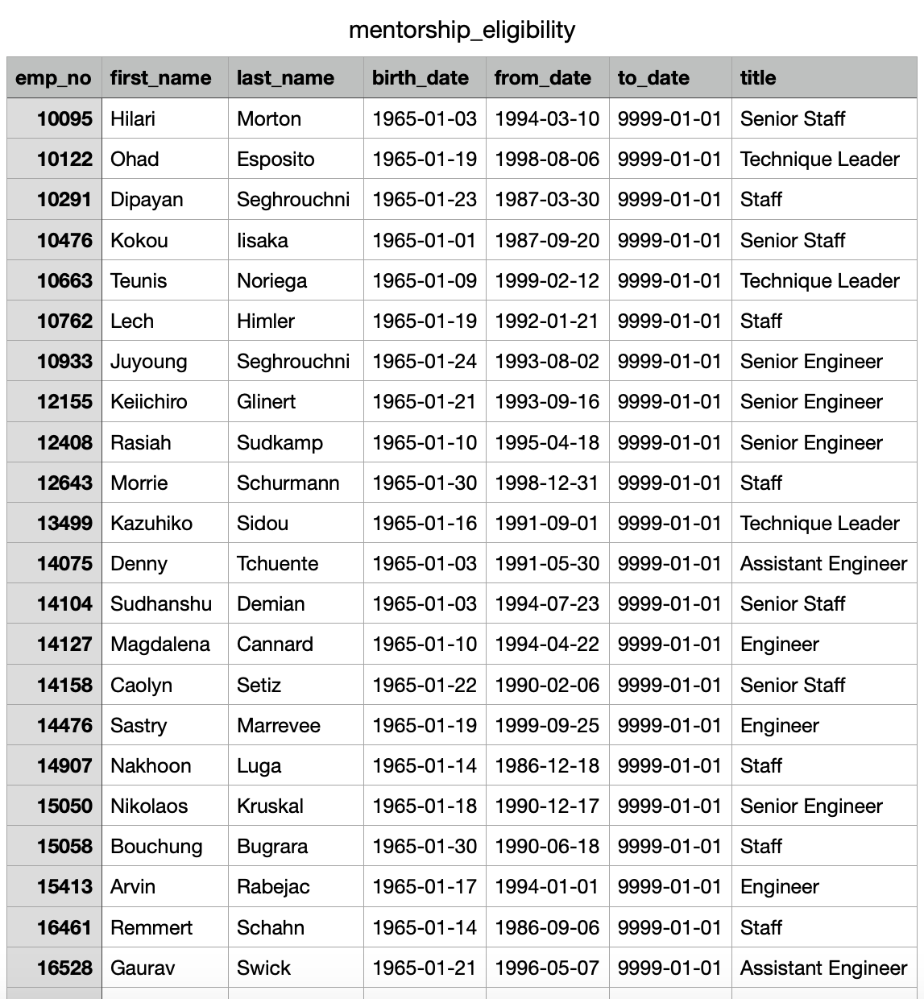
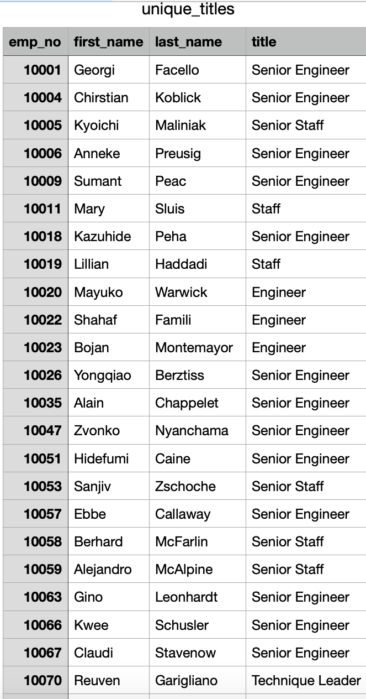

# Pewlet-Hackard-
Readme:
### Overview of the analysis: Explain the purpose of this analysis. The purpose of this analysis is to assist an employee Bobby who has to present to his manager the given data to determine the number of retiring employees per title, and identify employees who are eligible to participate in a mentorship program. Then, you’ll write a report that summarizes your analysis and helps prepare Bobby’s manager for the “silver tsunami” as many current employees reach retirement age.
## Results

<B><li> retirement_titles</li></B>

## Results: Provide a bulleted list with four major points from the two analysis deliverables. Use images as support where needed.

<B><li>retiring_titles</li></B>

## Summary: Provide high-level responses to the following questions, then provide two additional queries or tables that may provide more insight into the upcoming "silver tsunami."

<B><li>mentorship_eligibility</li></B>

### How many roles will need to be filled as the "silver tsunami" begins to make an impact?

<B><li>unique_titles</li></B>

### Are there enough qualified, retirement-ready employees in the departments to mentor the next generation of Pewlett Hackard employees?

<B><li>mentorship_eligibility</li></B>

